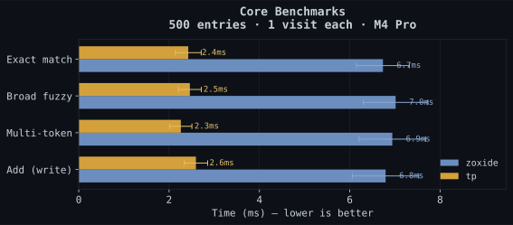
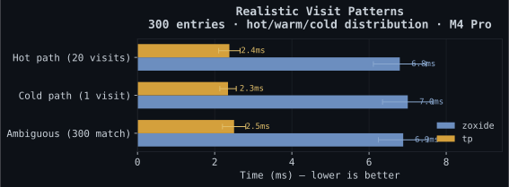
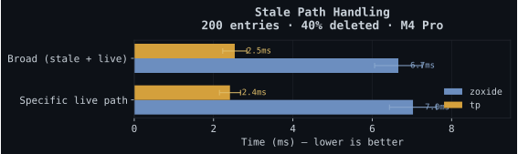
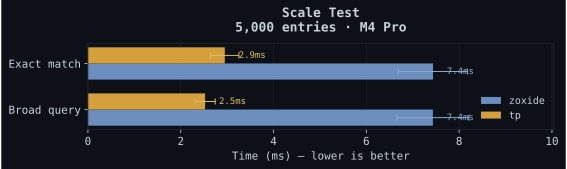

<p align="center">


<br/>

<h3>🎮 Unlock fast travel in your terminal.</h3>

[](https://www.rust-lang.org/)
[](LICENSE)
[](#status)

</p>

---

Your terminal knows where you've been. `tp` knows where you're going.

Project-aware navigation that combines frecency with context — so when you type `tp src`, it picks the `src/` in the project you're actually working in. Built in Rust, works in six shells, useful from the first command.

## Quick Start

```sh
cargo install --path .
eval "$(tp init zsh)"     # or bash, fish, powershell, nushell, elvish
```

Then just use it:

```sh
tp myproject               # jump to best match
tp -p tests                # find tests/ within the current project
tp @payments-service       # switch to a project by name
tp !deploy                 # teleport to a pinned waypoint
tp                         # interactive fuzzy picker
```

On first run, tp automatically indexes your shell history, imports from zoxide (if installed), and discovers projects under your home directory. No cold start.

---

## Why tp?

If you juggle multiple projects, tp was built for you.

| What you get | How it works |
|-------------|-------------|
| **Project-scoped search** | `tp -p tests` finds `tests/` within your current project, not globally |
| **Project jumping** | `tp @payments-service` switches to a project by name |
| **Waypoints** | `tp !deploy` — pin paths that frecency would forget |
| **Self-healing database** | Dead paths pruned automatically, never suggested |
| **Zero cold start** | Imports shell history, zoxide data, and discovers projects on first run |
| **AI tiebreaker** | When two paths score equally, an optional AI oracle picks the right one |

## Features

### Core Navigation

Free, open source, works entirely offline. No accounts, no cloud.

- **Frecency scoring** — frequency + recency with time-decay weighting
- **Multi-token fuzzy matching** — `tp foo bar` matches paths containing both tokens
- **Typo tolerance** — `tp projetcs` still finds `projects` (Damerau-Levenshtein fallback for 5+ char queries)
- **Project awareness** — detects projects via `.git`, `Cargo.toml`, `package.json`, `go.mod`, and [12 more markers](#project-markers)
- **Project-scoped search** — `tp -p tests` stays inside your project boundaries
- **Cross-project switching** — `tp @payments-service` jumps to a known project root
- **Waypoints** — `tp --mark deploy` pins a directory; `tp !deploy` teleports there
- **Smart cold start** — bootstraps from shell history, git repos, and existing zoxide databases
- **TUI picker** — interactive fuzzy finder with project name, last modified, and git branch
- **Full `cd` compatibility** — relative paths, `..`, `-`, `~`, absolute paths all just work
- **6 shells** — bash, zsh, fish, PowerShell, Nushell, Elvish
- **Tab completions** — dynamic completions for directories, waypoints, and projects in bash/zsh/fish + [Warp/Fig spec](completions/tp.ts)
- **Navigation history** — `tp back` to retrace your steps, stack-based (not just one level like `cd -`)

### AI Features (BYOK)

Bring your own API key, or don't. tp works perfectly without it — AI just breaks ties and adds flavor.

- **AI reranking** — when frecency scores are tied, AI considers your cwd and candidates to pick the right one
- **Session recall** — `tp --recall` answers the Monday morning question: *"where was I?"*
- **Smart aliasing** — `tp suggest` recommends waypoint names for your most-visited directories
- **Semantic project indexing** *(coming soon)* — search by concept: `tp the service that handles webhook retries`
- **Workflow prediction** *(coming soon)* — spots navigation patterns and nudges you toward the next stop
- **Natural language nav** *(planned)* — `tp the auth service terraform module` resolves even when none of those words appear in the path

### Pro *(coming soon)*

For teams that want shared context across machines.

- **Cross-machine sync** — frecency, waypoints, and project index via E2E encrypted cloud
- **Team waypoints** — canonical navigation shortcuts for the whole org
- **Onboarding mode** — new engineers inherit the team's navigation index on day one
- **Navigation analytics** — personal and team dashboards

---

## How It Works

Six steps from query to destination. Most trips end at step four.

```
 Query
   │
   ▼
 ┌─────────────────────┐
 │  1. Exact/relative?  │──▶ cd directly
 └──────────┬──────────┘
            │ no
 ┌──────────▼──────────┐
 │  2. Waypoint (!)?    │──▶ jump to pin
 └──────────┬──────────┘
            │ no
 ┌──────────▼──────────┐
 │  3. Project (@)?     │──▶ project root
 └──────────┬──────────┘
            │ no
 ┌──────────▼──────────┐
 │  4. Frecency + fuzzy │──▶ score > 0.8 → go  ← 95% of jumps
 └──────────┬──────────┘
            │ close call?
 ┌──────────▼──────────┐
 │ 4b. Typo tolerance   │──▶ Damerau-Levenshtein fallback
 └──────────┬──────────┘
            │ still too close
 ┌──────────▼──────────┐
 │  5. AI reranking     │──▶ ~150 tokens, <300ms
 └──────────┬──────────┘
            │ ¯\_(ツ)_/¯
 ┌──────────▼──────────┐
 │  6. TUI picker       │──▶ you choose
 └─────────────────────┘
```

AI is a tiebreaker, not a crutch. Navigation should never wait on a network request unless it genuinely doesn't know where you want to go.

---

## Installation

### From source

```sh
cargo install --path .
```

### Shell setup

One line in your shell config:

```sh
# bash (~/.bashrc)
eval "$(tp init bash)"

# zsh (~/.zshrc)
eval "$(tp init zsh)"

# fish (~/.config/fish/config.fish)
tp init fish | source

# PowerShell ($PROFILE)
Invoke-Expression (& { tp init powershell } | Out-String)

# Nushell (~/.config/nushell/env.nu)
tp init nushell | save -f ~/.cache/tp/init.nu; source ~/.cache/tp/init.nu

# Elvish (~/.config/elvish/rc.elv)
eval (tp init elvish | slurp)
```

Want a different command name? `eval "$(tp init bash --cmd j)"`

### Bootstrap

tp auto-bootstraps on first run. The first time you navigate with an empty database, it silently:

1. Imports your zoxide database (if installed)
2. Parses your shell history for `cd` targets
3. Scans common code directories (`~/code`, `~/projects`, `~/repos`, etc.) for project roots

Takes <500ms. Your first `tp` command already has context.

You can also import manually:

```sh
tp import --from=zoxide                                # import from zoxide
tp import --from=zoxide ~/.local/share/zoxide/db.zo    # import from file
```

## Usage

```
tp <query>              Navigate to best match
tp                      Interactive picker
tp -p <query>           Search within current project
tp @<project>           Jump to project root
tp !<waypoint>          Jump to waypoint

tp --mark <name> [path] Pin a directory
tp --unmark <name>      Remove a pin
tp --waypoints          List all waypoints

tp ls [-n COUNT]        List top directories by frecency
tp back [STEPS]         Jump back in navigation history

tp add <path>           Manually record a directory
tp remove <path>        Remove from database
tp query <query>        Print matches (for scripting)

tp init <shell>         Shell integration
tp import --from=zoxide Import from zoxide
tp completions <shell>  Generate shell completions

tp suggest              Suggest waypoint names for frequent paths
tp suggest --ai         Use AI for creative names

tp --recall             AI: "where was I?" session digest
tp --setup-ai           Configure AI API key

tp doctor               Diagnose issues
tp sync                 Cloud sync (Pro, coming soon)
```

## Configuration

All via environment variables. Sane defaults — most people won't touch these.

| Variable | Default | Description |
|----------|---------|-------------|
| `TP_DATA_DIR` | `$XDG_DATA_HOME/tp` | Database and config location |
| `TP_API_KEY` | — | Anthropic API key for AI features |
| `TP_AI_MODEL` | `claude-haiku-4-5-20251001` | AI model override |
| `TP_AI_TIMEOUT` | `2000` | AI request timeout (ms) |
| `TP_EXCLUDE_DIRS` | — | Comma-separated path prefixes to ignore (supports `~`) |

## Project Markers

tp walks up the directory tree looking for these files to detect project boundaries:

`.git` `Cargo.toml` `package.json` `go.mod` `pyproject.toml` `setup.py` `Gemfile` `pom.xml` `build.gradle` `CMakeLists.txt` `Makefile` `.project` `composer.json` `mix.exs` `deno.json` `flake.nix`

## Benchmarks

Measured with [hyperfine](https://github.com/sharkdp/hyperfine) on a MacBook Pro M4 Pro, 200+ runs each.

### Core queries (500 entries, flat seeding)

Raw query speed with 1 visit per path.

<p align="center">

</p>

### Realistic visit patterns (hot/warm/cold)

300 directories with varied visit counts: 50 "hot" paths (20 visits), 100 "warm" (5 visits), 150 "cold" (1 visit).

<p align="center">

</p>

### Stale path handling

200 directories, 40% deleted after seeding. tp validates paths on every query and self-heals — extra I/O, but your results are always clean.

<p align="center">

</p>

### Scale (5,000 entries)

<p align="center">

</p>

> tp's `add` does more work — it detects project roots by walking up the tree and logs session data. That's the cost of project-scoped search and session recall.

Run them yourself:

```sh
cargo build --release
./bench/bench.sh
python3 bench/chart.py   # generate SVG charts
```

## Architecture

<p align="center">

</p>

- **Core** — Rust, <5MB binary, <5ms navigation
- **Database** — SQLite with WAL mode, auto-migrations, indexed
- **AI & TUI** — compile-time feature flags (`--features ai,tui`), both on by default
- **Local-first** — fully functional offline. AI is the fallback, never the hot path.

## Design

- **Offline by default.** The network is a luxury, not a dependency.
- **Intelligence should be invisible.** No "AI mode." It just picks the right answer.
- **Zero config to start. Every knob available if you want it.**
- **Your data, your machine.** No telemetry. No accounts. No forced anything.

## Status

tp is in **beta**. Core navigation, frecency, project detection, waypoints, shell integration, AI reranking, TUI picker, and session recall are all working.

| Phase | Status | What shipped |
|-------|--------|-------------|
| **Alpha** | ✅ | Core: frecency, project detection, waypoints, 6-shell integration, bootstrap, zoxide import |
| **Beta** | ✅ | AI reranking (BYOK), TUI picker, session recall, smart aliasing, tab completions, typo tolerance. CI on 3 platforms. |
| **v1.0** | Planned | Semantic indexing, workflow prediction, natural language nav, VS Code extension |
| **Pro** | Planned | Cloud sync, team waypoints, onboarding mode, analytics |

## License

[MIT](LICENSE)
